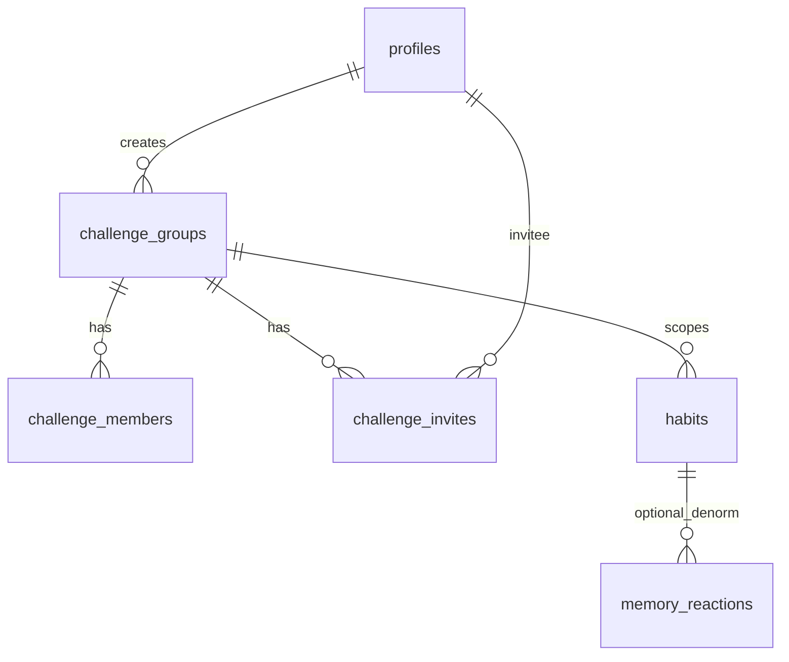

<!--
  Local copy of the Cursor plan for easy viewing in-repo (optional to commit).
  Canonical plan may also exist under ~/.cursor/plans/group_habit_challenges_*.plan.md
-->

---
name: Group habit challenges
overview: Add Supabase-backed group challenges with username search, invites (accept/decline), auto-cloned habits per member aligned to the creator’s calendar, cohort-visible streak memories with likes/comments, and in-app notifications (FCM-ready later).
todos:
  - id: migration-profiles-username
    content: Add profiles.username (unique) + search_profiles_by_username RPC + RLS for safe search
    status: pending
  - id: migration-challenge-tables
    content: Add challenge_groups, challenge_members, challenge_invites, notifications, likes/comments + habits.challenge_group_id
    status: pending
  - id: rls-habits-cohort
    content: Extend habits RLS SELECT for cohort members; keep write own-row only
    status: pending
  - id: types-sync
    content: Extend Habit type + habitToRow/habitFromRow + pull/push merge for peer habits
    status: pending
  - id: habit-store-tz
    content: On toggleCompletion for group habits, normalize date to creator TZ (challenge metadata in store or fetched)
    status: pending
  - id: ui-username-profile
    content: "Profile: set username; validation + conflict handling"
    status: pending
  - id: ui-invite-flow
    content: "Habit detail: invite by username; Compete: pending invites; accept/decline screens"
    status: pending
  - id: ui-challenge-screen
    content: New challenge/[id] calendar + memory viewer + likes/comments
    status: pending
  - id: notifications-in-app
    content: Notifications list + insert on invite/accept/comment/like; read state
    status: pending
  - id: memory-images-storage
    content: "Optional: upload streak memory images to Storage for cross-user viewing"
    status: pending
isProject: false
---

# Group habit challenges (social cohort)

## Product decision (confirmed)

- **User confirmation (2026-04-06):** Invitee habit **Option A** — same as below (not link-existing habit).
- **Invitee habit — option A (locked):** On accept, **auto-create** a matching habit (not link-existing): same title, mode, `totalDays`, rules; **new** local `habit.id`; same **`challenge_group_id`** as creator. Everyone is bound to one **`challenge_groups`** row.
- **Day/time anchor:** The **creator’s timezone + challenge start** defines the canonical calendar for “which day” a check-in counts (all clients convert “now” → **creator-local date** when recording `completed_dates` and when showing the shared calendar). Store `creator_timezone` (IANA string) and `challenge_start_date` (creator-local date) on the group.

## Why this needs server state

Today [`supabase/migrations/20260406120000_initial.sql`](../supabase/migrations/20260406120000_initial.sql) `habits` rows are **RLS: only `auth.uid() = user_id`**, so no other user can read streaks/memories. Group challenges require **shared read** for cohort members plus **invites** and **notifications**. This is a **Supabase-first** feature (auth already used in [`src/lib/sync.ts`](../src/lib/sync.ts)).

## Data model (new / extended)

**New tables (migration):**

1. **`profiles` extension:** `username` (unique, `citext` or lowercased `text` + unique index), `display_name` optional. **Search:** RPC `search_profiles_by_username(prefix text)` (security definer) returning `{ id, username, display_name }` for authenticated users—avoid exposing email.

2. **`challenge_groups`:** `id uuid PK`, `creator_id uuid`, `title text`, `habit_template jsonb` (mode, total_days, title snapshot), `creator_timezone text`, `start_date date` (creator-local), `status text` (active|ended|cancelled), `created_at timestamptz`.

3. **`challenge_members`:** `challenge_id`, `user_id`, `habit_id` (client habit id string), `role text` (creator|member), `joined_at`, unique `(challenge_id, user_id)`.

4. **`challenge_invites`:** `id`, `challenge_id`, `inviter_id`, `invitee_id`, `status` (pending|accepted|declined), `created_at`, unique pending constraint per pair+challenge optional.

5. **`notifications`:** `id`, `user_id`, `type` (invite|invite_accepted|memory_on_your_day|comment|like), `payload jsonb`, `read_at`, `created_at`. **FCM later:** Edge Function or trigger on insert pushes; app still reads same rows.

6. **Likes/comments (minimal):** `challenge_memory_comments` — `(id, challenge_id, subject_user_id, date_str, author_id, body, created_at)` with RLS: participants only. **Reactions:** `challenge_memory_likes` — unique `(challenge_id, subject_user_id, date_str, liker_id)` to enforce one like per user per memory cell.

**`habits` extension:** `challenge_group_id uuid null references challenge_groups(id)`.

**RLS (habits):** extend `SELECT` to allow read when `challenge_group_id` is set **and** `exists (select 1 from challenge_members m where m.challenge_id = habits.challenge_group_id and m.user_id = auth.uid())`. **INSERT/UPDATE/DELETE** still only for `auth.uid() = user_id`. This lets cohorts see each other’s `completed_dates` + `streak_memories` jsonb for habits tied to the group.

**Sync impact:** [`src/lib/sync.ts`](../src/lib/sync.ts) `pullFromSupabase` today loads only `eq("user_id", userId)`. Add a second query (or RPC) to pull **peer habits** for any `challenge_group_id` the user belongs to: `habits` where `challenge_group_id in (...)` and member check—implemented as **SQL view or RPC** `habits_visible_to_user()` returning merged rows, or two pulls merged client-side. **Types:** extend local `Habit` with optional `challengeGroupId`; merge remote peers into a **separate map** or read-only copies for UI to avoid overwriting local edits—detail in implementation (likely `cohortHabitsByChallengeId` in memory + existing store unchanged for “my” habits).

## Flows

1. **Creator** starts mission (existing habit) → “Add to group challenge” → creates `challenge_groups` + sets `habits.challenge_group_id` for creator’s habit + `challenge_members` row.
2. **Invite:** username search → create `challenge_invites` pending + `notifications` row for invitee.
3. **Accept:** validate invite → insert `challenge_members` → **create invitee habit** in local store + push to Supabase with same template fields, **same `challenge_group_id`**, new local `id`; align `startDate` / first slot to creator’s `start_date` + timezone rules.
4. **Decline:** update invite + optional notification to creator.
5. **Feed UI:** For a challenge, show a **calendar** (creator-local dates) with filled days per member; tap cell → memory viewer (read-only for others’ memories) + like + comment thread.
6. **Notifications UI:** Bell entry point (header or Profile) → list from `notifications`; mark read. Later: FCM triggers same types.

## UI placement

| Area | Purpose |
|------|--------|
| [`app/habit/[id].tsx`](../app/habit/[id].tsx) | Entry: “Challenge” sheet — invite search, pending invites, link to group screen |
| New `app/challenge/[id].tsx` | Cohort calendar, members strip, memory modal, likes/comments |
| [`app/(tabs)/compete.tsx`](../app/(tabs)/compete.tsx) | High-level: “Your group challenges” + pending invites |
| Settings / Profile | Set **username** once (validation, uniqueness) |

## Implementation phases (recommended)

**Phase 1 — Identity + groups skeleton:** migrations (`username`, tables), RLS policies, profile username edit screen, search RPC, create group + invite + accept/decline (no feed yet).

**Phase 2 — Habit visibility + sync:** `challenge_group_id` on habits, extended pull/push rules, auto-clone on accept, creator TZ date normalization in [`src/store/habitStore.ts`](../src/store/habitStore.ts) `toggleCompletion` when `challengeGroupId` set.

**Phase 3 — Feed + social:** challenge detail calendar, memory viewer for peers, likes + comments tables + UI, realtime optional (Supabase Realtime on `challenge_memory_comments`).

**Phase 4 — Notifications polish:** in-app badge + polling/Realtime; FCM Edge Function + device tokens table when ready.

## Risks / notes

- **Image URIs** in `streak_memories` are often **local file paths**; cohort cannot load them until **upload to Supabase Storage** with public/signed URLs—plan a small upload step on memory save for group habits, or scope v1 to **note-only** for shared memories.
- **Solo local challenges** in [`src/store/challengeStore.ts`](../src/store/challengeStore.ts) remain separate; rename UI labels if “Challenge” becomes ambiguous (“Solo goals” vs “Group challenge”).
- **Workspace path:** your IDE workspace may show as unset; implementation should target the **habitPro** repo path you use locally.
